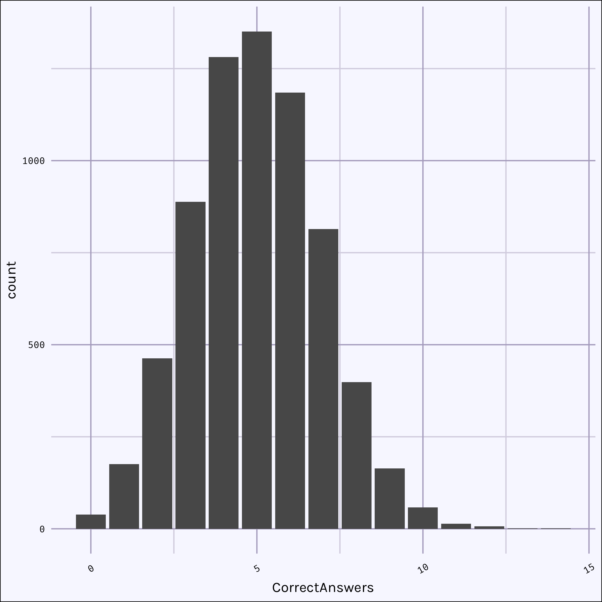

## The project
[The Chase](https://en.wikipedia.org/wiki/The_Chase_(British_game_show)) is a British quiz show running since 2009.  Players answer quiz questions to compete as a team against a quiz master, called the Chaser.  The game consists of three main sections: the Cash Builder, the Head-to-Head and the Final Chase.  This post is the first in a series of exploring statistics of the Chase.

## How The Chase works

The first Every player competes in the Cash Builder where they answer as many questions as they can in 60 seconds. 

## Data
Data for The Chase has been meticulous compiled on [One Question Shootout!](http://onequestionshootout.xyz/), ([Twitter](https://twitter.com/OneQnShootout)).  This website has catalogued a massive amount of data for The Chase's 14 (current) seasons.  There is data on each game: if the player or the chaser won, who the chaser was, total prize fund and much more.  For each player there is data on their performance in the Cash Builder, the Head-to-Head, the Final Chase. 

The data has been scraped and processed using a script available my [The Chase repo](https://github.com/campbead/thechase/blob/master/ETL.R).

### The data we don't have
Unfortunately, there isn't data on individual data on individual questions.  We don't know what questions were asked, or even how many many questions are asked during Cash Builder, Head to Head, and the Final Chase.

## Cash Builder
Each player in the show competes in the Cash Builder increase the overall pot size for the Final Chase, with correct answer in this phase being worth £1,000.  At present this analysis has 6840 data points for Cash Builder performance.

The figure below shows a median score for the Cash Builder to be 5. The distribution of correct answers is more-or-less bell shaped, with over half of all players scoring between 4-6. The highest score ever is 14, and 0.6% have scored 0.

And alternative way to look at this data is as a cumulative probability graph seen below.  What this figure shows is that just under 80% of players scoring 6 or less during this phase, and therefore any player 7 or great is the top ~20% of all players.  I will go on to show how correct answers in the cash builder can predict performance in other parts of the game.

## Low, Medium, High

## Doing better in the Cash Builder means you'll do better in the Head-to-Head
We can look at how likely players are to win their Head-to-Head based on the number of correct answers in the Cash Builder and the offer taken.
Players are offered a higher offer and lower offer, in addition to the middle offer based on the correct answers during the Cash Builder.

What is very clear here is the better a player does on on the Cash Builder round, the better their chances of winning the Head-to-Head and that is true for a player taking any of the offers.  A player taking a middle offer after answering 7 correct answers in the Cash Builder will have about a 70% chance of advancing into the Final Chase, whereas a player answering only 2 correct answers will only have about a 50% chance of advancing after taking a middle offer. It is also true picking the lower offer improves the player's chances of winning the Head-to-Head by about 9%, while picking the higher offer decreases the player's chances of winning the Head-to-Head by about 20%.

- Value of Low and High doesn't affect win %
We can also look at how the chance of winning the Head-to-Head is affected by the amount of the chosen offer

What is clear in the above figures is the chance is win isn't well correlated to the amount of the chosen offer, expect for middle offer which is because is middle offer amount is directly proportional to the amount of correct answers in Cash Builder round.

## Future topics
This is an ongoing series, in future posts I'll cover:

- factors influencing the choice of higher, middle, and lower offers,
- factors influencing the score in the Head-to-Head,
- statistics of the Final Chase.

